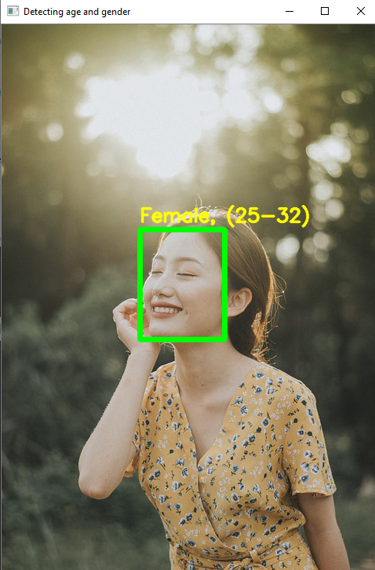
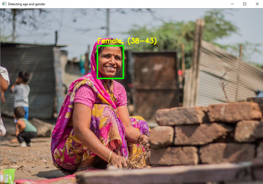
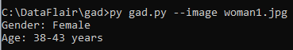
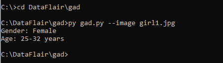

# Mini-Project--Application-of-NN
### BY NAVEEN KUMAR S
### 212221240033

## Project Title:
Age and Gender Prediction 
## Project Description 
To predict the age and gender using the image of the person.
## Algorithm:

1. We use the argparse library to create an argument parser so we can get the image argument from the command prompt. We make it parse the argument holding the path to the image to classify gender and age for.

2. For face, age, and gender, initialize protocol buffer and model.

3. Initialize the mean values for the model and the lists of age ranges and genders to classify from.

4. Now, use the readNet() method to load the networks. The first parameter holds trained weights and the second carries network configuration.

5. Let’s capture video stream in case you’d like to classify on a webcam’s stream. Set padding to 20.

6. Now until any key is pressed, we read the stream and store the content into the names hasFrame and frame. If it isn’t a video, it must wait, and so we call up waitKey() from cv2, then break.

7. Let’s make a call to the highlightFace() function with the faceNet and frame parameters, and what this returns, we will store in the names resultImg and faceBoxes. And if we got 0 faceBoxes, it means there was no face to detect.
Here, net is faceNet- this model is the DNN Face Detector and holds only about 2.7MB on disk.

Create a shallow copy of frame and get its height and width.
Create a blob from the shallow copy.
Set the input and make a forward pass to the network.
faceBoxes is an empty list now. for each value in 0 to 127, define the confidence (between 0 and 1). Wherever we find the confidence greater than the confidence threshold, which is 0.7, we get the x1, y1, x2, and y2 coordinates and append a list of those to faceBoxes.
Then, we put up rectangles on the image for each such list of coordinates and return two things: the shallow copy and the list of faceBoxes.
8. But if there are indeed faceBoxes, for each of those, we define the face, create a 4-dimensional blob from the image. In doing this, we scale it, resize it, and pass in the mean values.

9. We feed the input and give the network a forward pass to get the confidence of the two class. Whichever is higher, that is the gender of the person in the picture.

10. Then, we do the same thing for age.

11. We’ll add the gender and age texts to the resulting image and display it with imshow().
## Program:
```python
import cv2
import math
import argparse

def highlightFace(net, frame, conf_threshold=0.7):
    frameOpencvDnn=frame.copy()
    frameHeight=frameOpencvDnn.shape[0]
    frameWidth=frameOpencvDnn.shape[1]
    blob=cv2.dnn.blobFromImage(frameOpencvDnn, 1.0, (300, 300), [104, 117, 123], True, False)

    net.setInput(blob)
    detections=net.forward()
    faceBoxes=[]
    for i in range(detections.shape[2]):
        confidence=detections[0,0,i,2]
        if confidence>conf_threshold:
            x1=int(detections[0,0,i,3]*frameWidth)
            y1=int(detections[0,0,i,4]*frameHeight)
            x2=int(detections[0,0,i,5]*frameWidth)
            y2=int(detections[0,0,i,6]*frameHeight)
            faceBoxes.append([x1,y1,x2,y2])
            cv2.rectangle(frameOpencvDnn, (x1,y1), (x2,y2), (0,255,0), int(round(frameHeight/150)), 8)
    return frameOpencvDnn,faceBoxes


parser=argparse.ArgumentParser()
parser.add_argument('--image')

args=parser.parse_args()

faceProto="opencv_face_detector.pbtxt"
faceModel="opencv_face_detector_uint8.pb"
ageProto="age_deploy.prototxt"
ageModel="age_net.caffemodel"
genderProto="gender_deploy.prototxt"
genderModel="gender_net.caffemodel"

MODEL_MEAN_VALUES=(78.4263377603, 87.7689143744, 114.895847746)
ageList=['(0-2)', '(4-6)', '(8-12)', '(15-20)', '(25-32)', '(38-43)', '(48-53)', '(60-100)']
genderList=['Male','Female']

faceNet=cv2.dnn.readNet(faceModel,faceProto)
ageNet=cv2.dnn.readNet(ageModel,ageProto)
genderNet=cv2.dnn.readNet(genderModel,genderProto)

video=cv2.VideoCapture(args.image if args.image else 0)
padding=20
while cv2.waitKey(1)<0:
    hasFrame,frame=video.read()
    if not hasFrame:
        cv2.waitKey()
        break

    resultImg,faceBoxes=highlightFace(faceNet,frame)
    if not faceBoxes:
        print("No face detected")

    for faceBox in faceBoxes:
        face=frame[max(0,faceBox[1]-padding):
                   min(faceBox[3]+padding,frame.shape[0]-1),max(0,faceBox[0]-padding)
                   :min(faceBox[2]+padding, frame.shape[1]-1)]

        blob=cv2.dnn.blobFromImage(face, 1.0, (227,227), MODEL_MEAN_VALUES, swapRB=False)
        genderNet.setInput(blob)
        genderPreds=genderNet.forward()
        gender=genderList[genderPreds[0].argmax()]
        print(f'Gender: {gender}')

        ageNet.setInput(blob)
        agePreds=ageNet.forward()
        age=ageList[agePreds[0].argmax()]
        print(f'Age: {age[1:-1]} years')

        cv2.putText(resultImg, f'{gender}, {age}', (faceBox[0], faceBox[1]-10), cv2.FONT_HERSHEY_SIMPLEX, 0.8, (0,255,255), 2, cv2.LINE_AA)
        cv2.imshow("Detecting age and gender", resultImg)
```

## Output:




## Advantage :
1. This project is mainly used in predicting the age and gender of postem reports.
2. this can also be used for face dectection lock in various places like mobile phone ,offices,etc.
## Result:
Thus the age and age prediction has been implement sucessfully.
